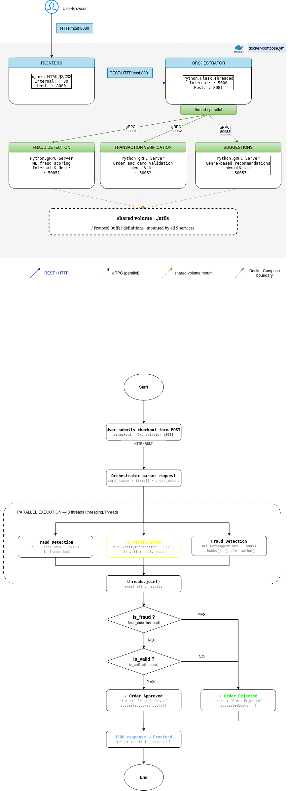

# Architecture Documentation

## System Overview

This distributed bookstore system implements a microservices architecture with REST and gRPC communication protocols.

## Services Architecture




## Communication Protocols

### REST API (Frontend ↔ Orchestrator)

**Endpoint: POST /checkout**
- Request: Order details with credit card and items
- Response: Order status and book suggestions

**Endpoint: POST /suggestions**
- Request: List of book titles
- Response: Recommended books

### gRPC Services (Orchestrator ↔ Backend)

**Fraud Detection Service (Port 50051)**
- Method: `CheckFraud(FraudRequest) → FraudResponse`
- Input: card_number, order_amount
- Output: is_fraud (boolean)

**Transaction Verification Service (Port 50052)**
- Method: `VerifyTransaction(TransactionRequest) → TransactionResponse`
- Input: card_number, items[]
- Output: is_valid (boolean), reason (string)

**Suggestions Service (Port 50053)**
- Method: `GetSuggestions(SuggestionsRequest) → SuggestionsResponse`
- Input: book_titles[]
- Output: books[] (title, author)

## Threading Implementation

The orchestrator uses Python's `threading` module to call all three gRPC services in parallel:

```python
# Create threads
t1 = threading.Thread(target=check_fraud, ...)
t2 = threading.Thread(target=check_transaction, ...)
t3 = threading.Thread(target=get_suggestions, ...)

# Start all threads
t1.start()
t2.start()
t3.start()

# Wait for completion
t1.join()
t2.join()
t3.join()
```

This parallel execution reduces total response time from sequential (T1 + T2 + T3) to parallel (max(T1, T2, T3)).

## Logging Strategy

All services implement structured logging with:
- Timestamp
- Log level (INFO, WARNING, ERROR)
- Contextual information (card numbers, items, results)

Example log format:
```
2024-01-15 10:30:45 [INFO] Checkout request received | items: ['Dune', 'Foundation']
2024-01-15 10:30:45 [INFO] Calling fraud detection | card: 1234567890123456 | amount: 2
2024-01-15 10:30:45 [INFO] No fraud detected
```

## Docker Compose Configuration

All services are containerized and orchestrated using Docker Compose:

- **Hot reload**: Code changes automatically reflected
- **Network isolation**: Services communicate via Docker network
- **Volume mounting**: Source code mounted for development
- **Environment variables**: Configuration passed to containers

## Data Flow

### Checkout Process

1. User submits order via frontend
2. Frontend sends POST request to `/checkout` endpoint
3. Orchestrator extracts order details
4. Orchestrator spawns 3 threads to call:
   - Fraud Detection (check card)
   - Transaction Verification (validate format)
   - Suggestions (get recommendations)
5. All threads execute in parallel
6. Orchestrator waits for all responses
7. Orchestrator evaluates results:
   - If fraud detected OR transaction invalid → Reject order
   - Otherwise → Approve order with suggestions
8. Response sent back to frontend

### Suggestion Process

1. User adds books to cart
2. Frontend sends POST request to `/suggestions` endpoint
3. Orchestrator calls Suggestions service
4. Suggestions service:
   - Identifies genres of cart items
   - Finds books from same genres
   - Excludes books already in cart
5. Recommendations returned to frontend

## Technology Stack

- **Frontend**: HTML, JavaScript, Nginx
- **Orchestrator**: Python, Flask, gRPC client
- **Backend Services**: Python, gRPC server
- **Containerization**: Docker, Docker Compose
- **Protocol Buffers**: gRPC message definitions
