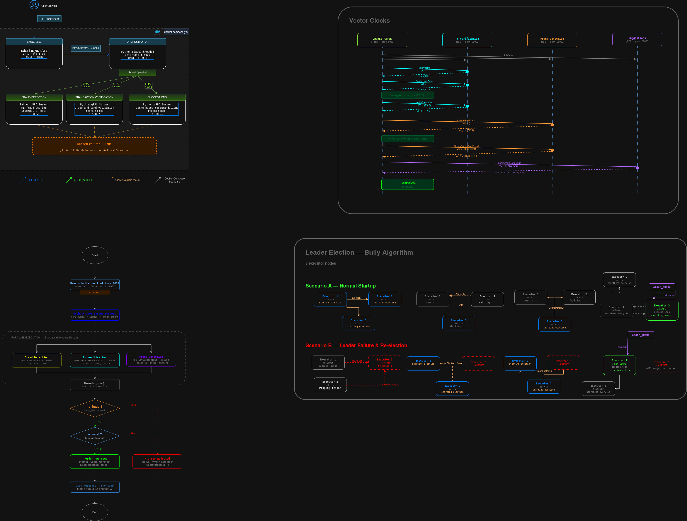

# Architecture Documentation

## System Overview

This distributed bookstore system implements a decoupled microservices architecture. It has evolved from a purely synchronous model to an asynchronous execution model, ensuring high availability and fault tolerance through leader election and causal consistency.

## Services Architecture

## Communication & Consistency

### Asynchronous Execution (Decoupling)

**Verification (Synchronous):** Orchestrator calls Fraud, Transaction, and Suggestions services.

**Execution (Asynchronous):** Once approved, the order is sent to the Order Queue. The user receives an immediate response while an Executor processes the order in the background.

### Causal Ordering (Vector Clocks)

To ensure events happen in the correct logical order, we implemented Vector Clocks:

- Causal Graph: The Orchestrator manages a 6-event partial order (events a through f).
- Merge Rule: Each service applies vc[service] = max(local, incoming) + 1 to track history.
- Cleanup: A ClearOrder broadcast with the final vector clock (VCf) is sent to all services after the checkout to wipe temporary state safely.

### Leader Election (Bully Algorithm)

To ensure Mutual Exclusion, we use the Bully Algorithm for our 3 Executor replicas:

- The Leader: Only the executor with the highest EXECUTOR_ID is allowed to call Dequeue from the Order Queue.

- Fault Tolerance: Followers monitor the leader via a Heartbeat mechanism. If the leader crashes, a new election is triggered automatically.

- Startup Fix: A 3-second delay was implemented during bootstrap to prevent "split-brain" scenarios caused by slow container networking.

### New gRPC Services

**Order Queue Service (Port 50054)**
- Enqueue(Order) → success: Used by the Orchestrator.
- Dequeue() → Order: Used by the Lead Executor.
- Locking: Uses threading.Lock() to prevent multiple executors from processing the same order.

**Order Executor Service (Ports 50055-50057)**
Replicated workers processing the queue.
- Protocols: Implements Election, Coordinator, and Heartbeat RPCs for coordination.

## Updated Port Mapping

| Service | Port (Host) | Protocol | Role |
| :--- | :--- | :--- | :--- |
| **Frontend** | 8080 | HTTP | User UI |
| **Orchestrator** | 8081 | HTTP/gRPC | System Coordinator |
| **Fraud Detection** | 50051 | gRPC | Identity/Card validation |
| **Transaction Verif.** | 50052 | gRPC | Data/Format validation |
| **Suggestions** | 50053 | gRPC | Genre-based recommendations |
| **Order Queue** | 50054 | gRPC | [cite_start]FIFO Shared Buffer [cite: 5] |
| **Executor 1** | 50055 | gRPC | [cite_start]Election Peer / Worker [cite: 170] |
| **Executor 2** | 50056 | gRPC | [cite_start]Election Peer / Worker [cite: 170] |
| **Executor 3** | 50057 | gRPC | Election Peer / Worker (Bonus) |

This parallel execution reduces total response time from sequential (T1 + T2 + T3) to parallel (max(T1, T2, T3)).

## Failure Modes & Recovery

1. Service Crash: Orchestrator catches gRPC exceptions and returns a graceful rejection to the user.

2. Leader Crash: Heartbeat timeout triggers a re-election among executors within 5 seconds.

3. Causal Violation: The ClearOrder guard prevents services from deleting state if the incoming vector clock is outdated.

