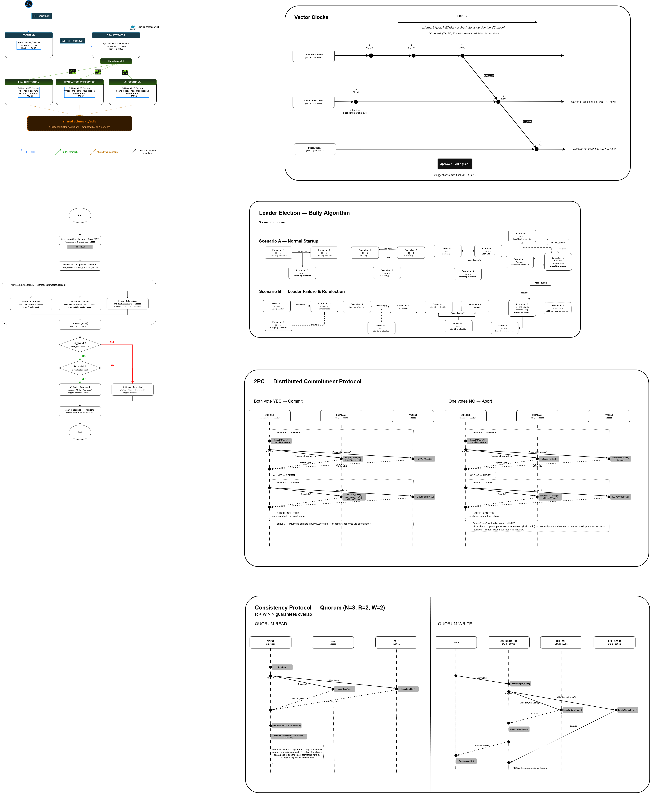

# Architecture Documentation

## Checkpoint 3 Overview

This checkpoint extends the distributed bookstore with a payment participant and a two-phase commit workflow. The goal is to keep the existing asynchronous order execution flow while guaranteeing that stock updates and payment execution are coordinated safely.

## Updated Architecture

### Main Changes

- The **Order Executor** now acts as the 2PC coordinator for the final purchase step.
- The **Books Database** participates in 2PC and commits writes through **quorum replication**.
- The **Payment Service** is a new 2PC participant that stages transactions locally before commit.
- Recovery is required for the payment participant so that a crash after Prepare does not lose in-flight transactions.

## Services In Scope for Checkpoint 3

### Order Executor
- Coordinates Prepare, Commit, and Abort.
- Sends Prepare requests to the database and payment participant in parallel.
- Sends Commit only after all participants vote YES.

### Books Database
- Locks the target book during Prepare.
- Stages the write in memory until Commit.
- On Commit, applies the write through `quorum_write` so all replicas are updated.
- On Abort, releases the lock without modifying the committed stock.

### Payment Service
- Votes YES during Prepare when the transaction is valid.
- Persists the transaction intent to a local file before acknowledging Prepare.
- On Commit, logs the payment execution and removes the staged transaction.
- On Abort, removes the staged transaction without executing payment.

## Two-Phase Commit Flow

1. The coordinator receives a completed order from the queue.
2. It sends Prepare to **all three Books Database replicas** and the Payment Service in parallel.
3. Each Books Database replica validates the expected version (CAS guard), locks the book key, and stores the staged write locally.
4. The Payment Service writes the staged payment intent to its JSON recovery file.
5. If all participants vote YES, the coordinator sends Commit to all of them.
6. Each Books Database replica applies the staged write locally (`local_write`). No quorum fan-out is needed here because all replicas already participated in Prepare.
7. The Payment Service logs the execution and clears its staged state.
8. If any participant votes NO, the coordinator sends Abort to all participants.

### Transaction ID format

Each 2PC transaction is identified by `"{order_id}-{item_name}-{attempt}"`. Including the retry attempt number ensures that a failed-and-retried round starts a fresh transaction ID, so no replica can confuse a stale staged write from a previous attempt with the current one.

## Recovery and Consistency

### Database
- Consistency is preserved through quorum writes during Commit.
- The database does not expose the new value until Commit succeeds.
- If the coordinator aborts, the lock is released and nothing is written.

### Payment
- Recovery is handled by reloading staged transactions from the recovery file at startup.
- If a crash happens after Prepare but before Commit, the participant can report the in-flight transaction on restart.
- Duplicate Commit and Abort requests are idempotent.

## Updated Port Mapping

| Service | Port (Host) | Role |
| :--- | :--- | :--- |
| Frontend | 8080 | User UI |
| Orchestrator | 8081 | API coordinator |
| Fraud Detection | 50051 | Validation |
| Transaction Verification | 50052 | Validation |
| Suggestions | 50053 | Recommendations |
| Order Queue | 50054 | FIFO queue |
| Executor 1 | 50055 | Coordinator candidate |
| Executor 2 | 50056 | Coordinator candidate |
| Executor 3 | 50057 | Coordinator candidate |
| Payment | 50061 | 2PC participant |

## Coordinator Failure Analysis

**Case 1 — Executor crashes after Phase 1 (all voted YES, no Commit sent yet)**
Both database and payment are in PREPARED state, holding locks on their resources. Without a Commit or Abort signal from the coordinator, they block indefinitely. No participant can safely self-abort because the other may have already committed — this is the fundamental blocking problem of 2PC.

**Case 2 — Executor crashes mid Phase 2 (e.g. Commit reached database but not payment)**
The database has committed and updated stock. The payment service is still in PREPARED state. The system is now inconsistent — one participant committed, the other did not.

**Proposed recovery solution**
Before sending any Phase 2 messages, the executor writes the transaction decision (COMMIT or ABORT) along with the transaction ID to a persistent WAL (write-ahead log) or the order queue. When the executor crashes and Bully election fires, the newly elected leader reads the WAL on startup. For any transaction found in DECIDED state, it re-sends Commit or Abort to all participants. Participants handle duplicate Commit/Abort idempotently (already implemented in the payment service). This guarantees that once a decision is made it will eventually reach all participants, even across coordinator failures.

## Orchestrator HTTP API

The Orchestrator exposes three HTTP endpoints:

| Method | Path | Description |
| :--- | :--- | :--- |
| POST | `/checkout` | Full checkout pipeline: verifications → enqueue → response. |
| GET | `/catalogue` | Returns the book catalogue read directly from the quorum-backed database. |
| POST | `/suggestions` | Returns genre-based recommendations for a given list of book titles (body: `{"book_titles": [...] }`). Used by the index page before checkout. |

The `/catalogue` endpoint performs a quorum read — it tries each DB replica in order and returns the first successful response. This means the catalogue is always served from the distributed database, not a static list.

## Bonus — Concurrent Write Handling

Concurrent writes to the same book are handled via optimistic concurrency control using version numbers (Compare-and-Swap). Each Read returns the current version alongside the stock value. A Prepare only succeeds if the submitted `expected_version` matches the current version on that replica. If two orders read the same version and both attempt a Prepare, only one succeeds — the other receives a version mismatch error and votes NO, causing the coordinator to abort and retry from a fresh Read. The executor detects this via the gRPC `ABORTED` status code returned by the database (`_is_cas_conflict` + retry loop in `order_executor/src/app.py`).

## Demo Points

- **Happy path**: approved order, DB stock updated everywhere, payment executed.
- **Abort path**: one participant votes NO, DB unlocks without committing, payment is not executed.
- **Recovery path**: payment crashes after Prepare, restarts, and loads the staged transaction from disk.
