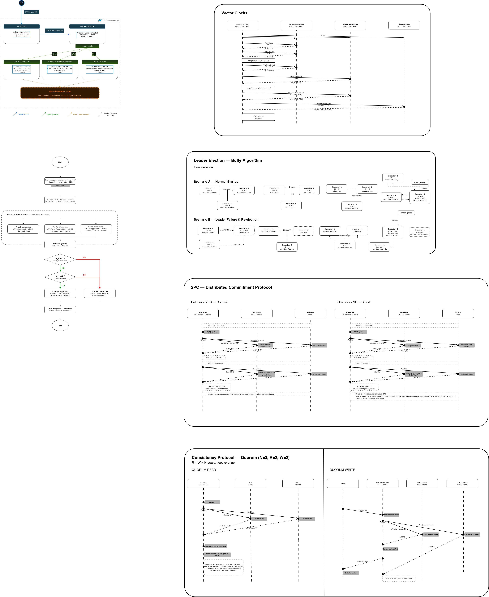

# Architecture Documentation

## Checkpoint 3 Overview

This checkpoint extends the distributed bookstore with a payment participant and a two-phase commit workflow. The goal is to keep the existing asynchronous order execution flow while guaranteeing that stock updates and payment execution are coordinated safely.

## Updated Architecture

### Main Changes

- The **Order Executor** now acts as the 2PC coordinator for the final purchase step.
- The **Books Database** participates in 2PC and commits writes through **quorum replication**.
- The **Payment Service** is a new 2PC participant that stages transactions locally before commit.
- Recovery is required for the payment participant so that a crash after Prepare does not lose in-flight transactions.

## Services In Scope for Checkpoint 3

### Order Executor
- Coordinates Prepare, Commit, and Abort.
- Sends Prepare requests to the database and payment participant in parallel.
- Sends Commit only after all participants vote YES.

### Books Database
- Locks the target book during Prepare.
- Stages the write in memory until Commit.
- On Commit, applies the write through `quorum_write` so all replicas are updated.
- On Abort, releases the lock without modifying the committed stock.

### Payment Service
- Votes YES during Prepare when the transaction is valid.
- Persists the transaction intent to a local file before acknowledging Prepare.
- On Commit, logs the payment execution and removes the staged transaction.
- On Abort, removes the staged transaction without executing payment.

## Two-Phase Commit Flow

1. The coordinator receives a completed order from the queue.
2. It sends Prepare to the Books Database and Payment Service in parallel.
3. The Books Database locks the book key and stores the staged write.
4. The Payment Service writes the staged payment intent to its JSON recovery file.
5. If both participants vote YES, the coordinator sends Commit to both.
6. The Books Database commits the write through quorum replication.
7. The Payment Service logs the execution and clears its staged state.
8. If any participant votes NO, the coordinator sends Abort to both.

## Recovery and Consistency

### Database
- Consistency is preserved through quorum writes during Commit.
- The database does not expose the new value until Commit succeeds.
- If the coordinator aborts, the lock is released and nothing is written.

### Payment
- Recovery is handled by reloading staged transactions from the recovery file at startup.
- If a crash happens after Prepare but before Commit, the participant can report the in-flight transaction on restart.
- Duplicate Commit and Abort requests are idempotent.

## Updated Port Mapping

| Service | Port (Host) | Role |
| :--- | :--- | :--- |
| Frontend | 8080 | User UI |
| Orchestrator | 8081 | API coordinator |
| Fraud Detection | 50051 | Validation |
| Transaction Verification | 50052 | Validation |
| Suggestions | 50053 | Recommendations |
| Order Queue | 50054 | FIFO queue |
| Executor 1 | 50055 | Coordinator candidate |
| Executor 2 | 50056 | Coordinator candidate |
| Executor 3 | 50057 | Coordinator candidate |
| Payment | 50061 | 2PC participant |

## Demo Points

- **Happy path**: approved order, DB stock updated everywhere, payment executed.
- **Abort path**: one participant votes NO, DB unlocks without committing, payment is not executed.
- **Recovery path**: payment crashes after Prepare, restarts, and loads the staged transaction from disk.
