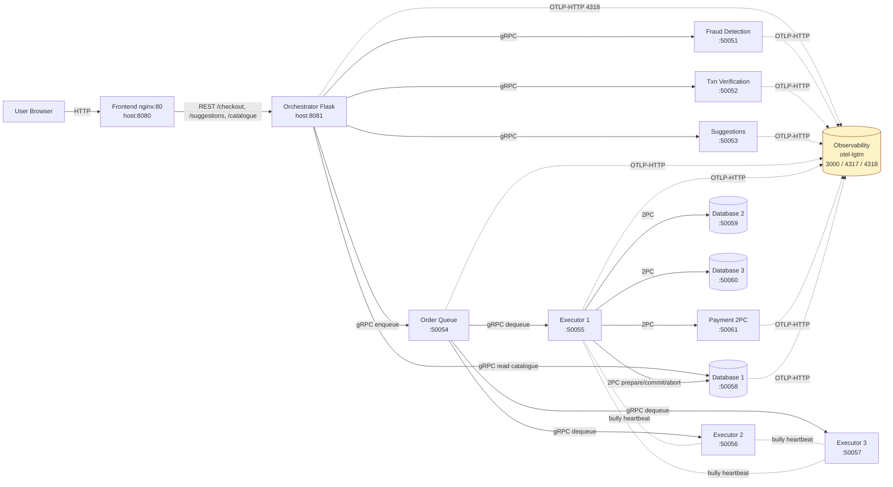

# Architecture Documentation

## Checkpoint 4 Overview

Checkpoint 4 finalizes the distributed bookstore with end-to-end observability and a closed test loop. The 2PC choreography from CP3 (executor coordinator, database replicas, payment participant) is unchanged; what's new is the OpenTelemetry instrumentation across every Python service, three new Grafana dashboard panels, and the Locust test suite covering single, concurrent, mixed-fraud, and conflicting orders, plus three failure-mode scenarios (leader kill, cascading leader kills, database quorum loss).

## What's new since CP3

- Every Python service emits OTLP traces + metrics to the `observability` (grafana/otel-lgtm) container.
- `utils/monitoring.py` is now the single source of truth for instruments: 12 counters, 2 up-down counters, 4 histograms, 3 async gauges.
- Resource attributes include `service.name` per service plus `service.instance.id` for the three executor replicas and three database replicas.
- Grafana dashboard `ds_practice_2pc_dashboard` adds fraud rejection rate, prepare-vote split, and leader transitions panels.
- `tests/locustfile.py` covers all four required scenarios plus three bonus failure scenarios.

## Final architecture diagram

## Updated port mapping

| Service | Host port | Container port | Role |
|---|---|---|---|
| Frontend | 8080 | 80 | Static UI (nginx) |
| Orchestrator | 8081 | 5000 | REST coordinator |
| Fraud Detection | 50051 | 50051 | gRPC validator |
| Transaction Verification | 50052 | 50052 | gRPC validator |
| Suggestions | 50053 | 50053 | gRPC recommender |
| Order Queue | 50054 | 50054 | gRPC FIFO + leader endpoint |
| Executor 1 | 50055 | 50050 | 2PC coordinator candidate |
| Executor 2 | 50056 | 50050 | 2PC coordinator candidate |
| Executor 3 | 50057 | 50050 | 2PC coordinator candidate |
| Payment | 50061 | 50061 | 2PC participant |
| Database 1 | 50058 | 50055 | Replica + quorum |
| Database 2 | 50059 | 50055 | Replica + quorum |
| Database 3 | 50060 | 50055 | Replica + quorum |
| Observability (Grafana) | 3000 | 3000 | UI (admin/admin) |
| Observability (OTLP gRPC) | 4317 | 4317 | OTel ingest |
| Observability (OTLP HTTP) | 4318 | 4318 | OTel ingest |

## Telemetry summary

| Service | Spans emitted | Counters | UpDownCounters | Histograms | Async Gauges |
|---|---|---|---|---|---|
| orchestrator | checkout_request, fraud_check, txn_verification, suggestions_fetch, enqueue_order | checkout_requests_total | – | – | – |
| fraud-detection | fraud.check_user, fraud.check_card | fraud_checks_total, fraud_rejections_total | – | – | – |
| transaction-verification | txn_verif.items, txn_verif.user, txn_verif.card | verification_checks_total | – | verification_latency | – |
| suggestions | suggestions.get | suggestions_served_total | – | suggestion_latency | – |
| order-queue | order_queue.enqueue, order_queue.dequeue | order_queue_enqueue_total, order_queue_dequeue_total | current_queue_size | – | – |
| order-executor | run_2pc_process | total_orders_total, total_2pc_aborts, prepare_votes_total, transaction_outcomes_total, bully_elections_started_total | – | txn_2pc_latency | book_stock_level, bully_alive_executors, current_leader_id |
| payment | payment.prepare, payment.commit, payment.abort | – | active_prepared_transactions | txn_2pc_latency | – |
| database-replica | quorum_read_db | – | active_prepared_transactions | quorum_read_latency | book_stock_level |

## Demo points

- **Happy path (S1).** Single non-fraudulent order. Dashboard panels 1, 2, 3, 4, 7, 8 light up. Logs show `[2PC]`, `[PREPARE]`, `[COMMIT]`.
- **Mixed load (S3).** Panel 11 fraud rejection rate climbs to ≈ 0.25 (one in four orders is fraudulent).
- **Conflicting load (S4).** Panel 12 prepare-vote split shows occasional "no" votes from the database due to CAS conflicts.
- **Failover (S5).** Panel 13 shows one leader transition; panel 10 alive-executors drops to 2 then recovers to 3.
- **Cascading failover (S6).** Panel 13 transitions = 2. Alive-executors drops to 2 then 1 then recovers to 3.
- **Quorum loss (S7).** Panel 12 prepare-vote split: database "no" votes spike when only 1 replica remains.
- **Recovery (CP3 carry-over).** Stop payment after Prepare; restart; logs show `[RECOVERY] Loaded ... staged transactions`.
